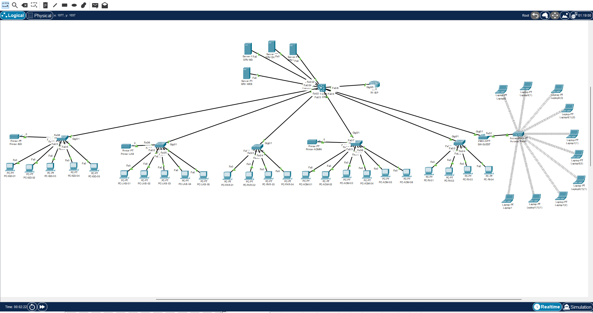

# 🏥 Hospital Network Infrastructure Project


Enterprise Hospital Network Infrastructure simulation developed using **Cisco Packet Tracer**. This project demonstrates the implementation of enterprise network design principles, including VLAN segmentation, Layer 3 Switching, Inter-VLAN Routing, DHCP, DNS, Wireless Networking, and Access Control Lists (ACL) to provide a secure, scalable, and manageable hospital network environment.

---

## 📌 Project Overview

This project simulates the network infrastructure of a modern hospital consisting of multiple departments, including **Emergency (IGD), Laboratory, Pharmacy, Administration, Inpatient, Server Room, and Guest WiFi**. Each department is separated using VLAN segmentation to improve security, simplify network management, and reduce unnecessary broadcast traffic.

The network utilizes **Layer 3 Switching (SVI)** to provide Inter-VLAN Routing, while centralized **DHCP**, **DNS**, and **HTTP** services support daily hospital operations. Security is enforced through **Access Control Lists (ACLs)** that isolate the Guest WiFi network from internal hospital resources, ensuring that only authorized users can access critical systems.

---

## 🖼 Project Overview


---

## 🌐 Cisco Packet Tracer Topology



---

# 🏗 Network Architecture

### Infrastructure

| Device | Quantity |
|---------|---------:|
| Router | 1 |
| Layer 3 Switch | 1 |
| Access Switch | 6 |
| Wireless Access Point | 1 |

### End Devices

| Device | Quantity |
|---------|---------:|
| Desktop PCs | 25 |
| Guest Laptops | 10 |
| Network Printers | 4 |
| Servers | 4 |

---

# 🏢 VLAN & IP Addressing Plan

| VLAN | Department | Network | Gateway |
|------|------------|----------------|----------------|
|10|Emergency (IGD)|192.168.10.0/24|192.168.10.1|
|20|Laboratory|192.168.20.0/24|192.168.20.1|
|30|Pharmacy|192.168.30.0/24|192.168.30.1|
|40|Administration|192.168.40.0/24|192.168.40.1|
|50|Inpatient|192.168.50.0/24|192.168.50.1|
|60|Server Room|192.168.60.0/24|192.168.60.1|
|70|Guest WiFi|192.168.70.0/24|192.168.70.1|
|99|Management|192.168.99.0/24|192.168.99.1|

---

# ✨ Key Features

- VLAN Segmentation
- Layer 3 Switching (SVI)
- Inter-VLAN Routing
- DHCP Server
- DNS Server
- HTTP Web Server
- Database Server
- Wireless Access Point
- Guest WiFi
- Network Printer Integration
- Access Control Lists (ACL)
- Security Segmentation

---

# 🔒 Security Policy

### Internal Network

- Full communication between authorized departments.
- Access to DHCP, DNS, HTTP, and Database servers.
- Printer communication within each department.

### Guest WiFi

- Internet and wireless connectivity.
- DHCP address assignment.
- **Blocked** from accessing:
  - Server Room VLAN
  - Database Server
  - Internal Department VLANs

ACL is implemented on the Layer 3 Switch to enforce these security policies.

---

# 🧪 Testing Results

| Test Case | Result |
|------------|:------:|
| VLAN Connectivity | ✅ PASS |
| Inter-VLAN Routing | ✅ PASS |
| DHCP Address Assignment | ✅ PASS |
| DNS Name Resolution | ✅ PASS |
| HTTP Web Server Access | ✅ PASS |
| Wireless Client Connectivity | ✅ PASS |
| Network Printer Connectivity | ✅ PASS |
| ACL Security Validation | ✅ PASS |

---

# 🛠 Tools & Technologies

- Cisco Packet Tracer
- Cisco IOS
- VLAN
- Layer 3 Switching (SVI)
- Inter-VLAN Routing
- DHCP
- DNS
- HTTP
- Access Control Lists (ACL)
- Wireless Networking

---

# 📂 Repository Structure

```text
Hospital-Network-Infrastructure
│
├── Hospital_Network_Infrastructure_Project.pkt
├── README.md
├── LICENSE
│
└── images
    ├── network-topology.png
    └── project-overview.png
```

---

# 🚀 Learning Outcomes

Through this project, the following networking concepts were implemented and validated:

- Enterprise VLAN Design
- Network Segmentation
- Layer 3 Switching
- Inter-VLAN Routing
- DHCP & DNS Services
- Wireless Network Deployment
- Access Control List (ACL)
- Network Security Policy
- Enterprise Network Documentation

---

# 📄 License

This project is licensed under the **MIT License**.
